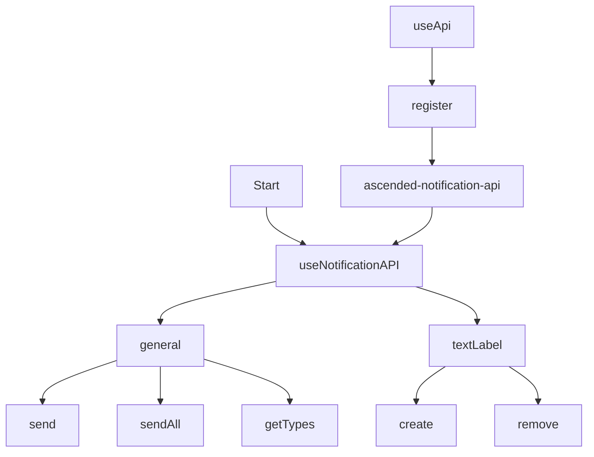

# Ascended Notification System

Welcome to the Ascended Notification System! This plugin provides a powerful and flexible notification system for your alt:V server, enhancing user experience with customizable notifications and text labels.

## API Flow

Below is a flowchart representing the structure and flow of the `api.ts` file:



## Features

-   **Customizable Notifications**: Create and send notifications with various types (INFO, ERROR, SUCCESS, WARNING).
-   **Text Labels**: Display dynamic text labels for players.
-   **Localization Support**: Easy integration with translation systems.
-   **Dark Mode**: Built-in support for dark mode UI.
-   **Sound Effects**: Optional sound effects for notifications and labels.
-   **Flexible Positioning**: Configure the position of notifications and text labels on the screen.
-   **Debug Mode**: Built-in debugging features for easier development.
-   **Server-side API**: Easy-to-use API for sending notifications from your server-side code.

## Installation

1. Clone this repository into your alt:V server's `/src/plugins` directory:

```bash
cd /path/to/your/altv/server/src/plugins
git clone https://github.com/yourusername/ascended-notification-system.git
```

2. That's it! The plugin will automatically start when your server runs.

## Usage

### Sending a Notification

```typescript
import * as alt from 'alt-server';
import { useApi } from '@Server/api/index.js';

const api = useApi();
const notificationApi = api.get('ascended-notification-api');

notificationApi.general.send(player, {
    icon: notificationApi.general.getTypes().SUCCESS,
    title: 'Welcome!',
    subtitle: 'Greetings',
    message: 'Welcome to our server!',
    duration: 5000, // Optional: Duration in milliseconds
    oggFile: 'notification', // Optional: Sound effect file name
});
```

### Creating a Text Label

```typescript
notificationApi.textLabel.create(player, {
    keyToPress: 'E',
    label: 'Press E to interact',
    oggFile: 'notification', // Optional: Sound effect file name
});
```

### Removing a Text Label

```typescript
notificationApi.textLabel.remove(player);
```

## Configuration

You can customize the notification system behavior by modifying the `config.ts` file:

```typescript
export const ASCNotifications: ASCNotification = {
    debug: false,
    sounds: true,
    labelSound: true,
    enableRebarSelector: false,
    duration: 10000,
    darkMode: true,
    position: 'top-left',
    textlabelPosition: 'right-center',
};
```
